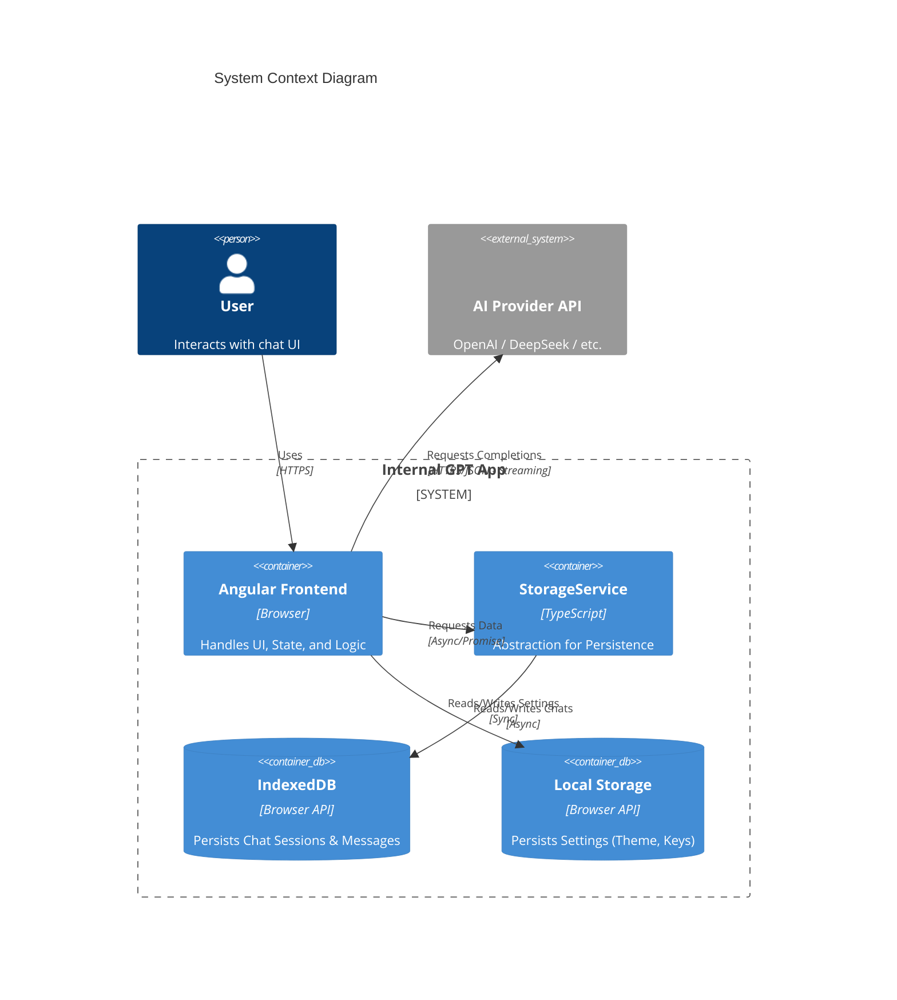

# System Architecture: Internal GPT

## **High-Level Design**

Internal GPT acts as a **Client-Side SPA (Single Page Application)** that directly interfaces with AI Provider APIs. No intermediate backend server is involved, ensuring logical data isolation and privacy.



## **Core Modules**

### **1. Presentation Layer (Components)**

Built using **Angular Standalone Components**, prioritizing composition over inheritance.

- **`ChatContainerComponent`**: The core orchestrator. Manages message flow, handles route parameters for session switching, and coordinates with `ChatService`.
- **`MessageListComponent`**: Renders message bubbles. Supports rich markdown, code syntax highlighting (via pure CSS/structure), and "Copy Code" actions.
- **`HistoryComponent`**: Provides a searchable list of all past conversations stored in IndexedDB.
- **`MessageInputComponent`**: Capsule-styled input with auto-resize and validation.
- **`SettingsModalComponent`**: UI for managing API keys, providers, and model selection.
- **`ClearChatToastComponent`**: Interactive confirmation toast via `ngx-sonner`.

### **2. State Management Layer**

State is managed via **Reactive Services** (Service-as-a-Store pattern).

- **Store**: `BehaviorSubject<ChatState>` held within `ChatService`.
- **State Interface**:
  ```typescript
  interface ChatState {
    messages: Message[]; // { role: 'user'|'assistant', content: string, ... }
    isLoading: boolean;
    error: string | null;
  }
  ```
- **Actions**: Methods on `ChatService` (e.g., `sendUserMessage`, `clearMessages`) trigger API calls and push new state to the subject.

### **3. Data Persistence Layer**

- **Settings**: `SettingsService` abstracts `localStorage`. It loads configuration on bootstrap and saves updates synchronously.
- **Chat Data**: `StorageService` provides an asynchronous interface to **IndexedDB**.
  - **Schema**: Stores `ChatSession` objects containing message arrays, titles, and timestamps.
  - **Migration**: Automated logic handles the transfer of legacy `localStorage` messages to the new IndexedDB schema on first run.
- **Secrets**: API Keys are stored in plain text in `localStorage`. _Security Note: This is intended for personal/local use only._

### **4. Style System**

- **Layout**: Strict adherence to Flexbox/Grid systems using the `gap` property for all sibling spacing, eliminating ad-hoc margins.
- **Formatting**: Enforced via **Prettier** with a Husky pre-commit hook triggering `lint-staged`.

## **Sequence: Message Lifecycle**

1.  **User Input**: User types in `MessageInputComponent` → hits Send.
2.  **Event**: `sendMessage` event emitted to `ChatContainer`.
3.  **Service Action**: `ChatContainer` calls `ChatService.sendUserMessage(text)`.
4.  **State Update 1**: Service pushes new state: `messages: [...old, userMsg], isLoading: true`.
5.  **API Request**: `OpenaiService` constructs HTTP request using config from `SettingsService`.
6.  **Response Handling**:
    - _Success_: Service pushes state: `messages: [...msgs, aiMsg], isLoading: false`.
    - _Error_: Service pushes state: `error: 'Error msg', isLoading: false`.

## **Directory Map**

| Path                                       | Responsibility                                  |
| :----------------------------------------- | :---------------------------------------------- |
| `src/app/core/services/`                   | Business & API Logic (State holders)            |
| `src/app/core/services/storage.service.ts` | IndexedDB abstraction layer                     |
| `src/app/core/models/`                     | Type definitions (`Message`, `ChatSession`)     |
| `src/app/components/`                      | UI widgets & Smart Containers                   |
| `src/app/components/history/`              | Chat session management & search                |
| `src/styles.css`                           | Global Tailwind, Semantic Tokens & Theme config |
