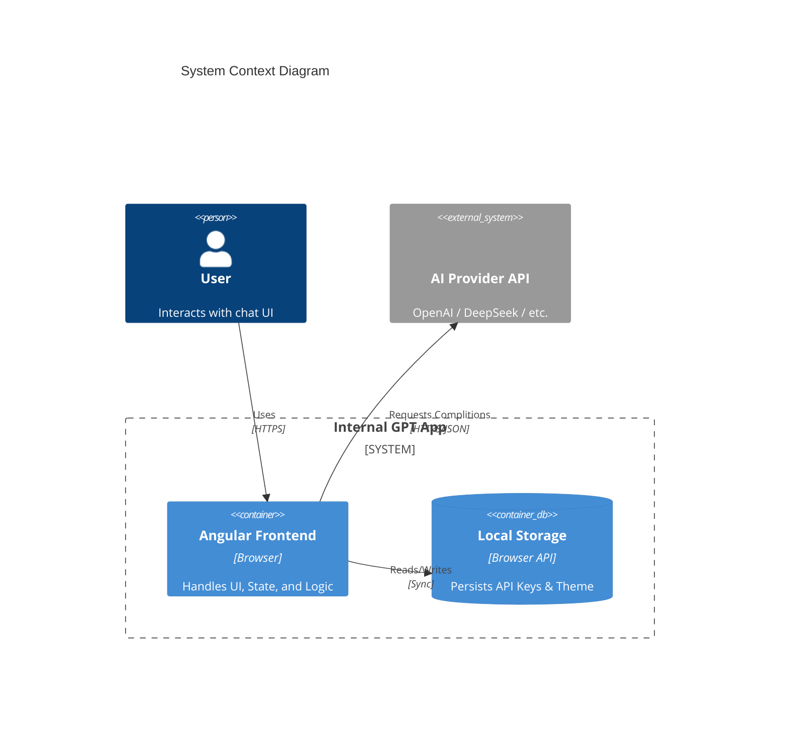

# System Architecture: Internal GPT

## **High-Level Design**

Internal GPT acts as a **Client-Side SPA (Single Page Application)** that directly interfaces with AI Provider APIs. No intermediate backend server is involved, ensuring logical data isolation and privacy.



## **Core Modules**

### **1. Presentation Layer (Components)**

Built using **Angular Standalone Components**, prioritizing composition over inheritance.

- **`ChatContainerComponent`**: The "Smart" component. Orchestrates state subscriptions (`ChatState`), layout logic, and modal visibility.
- **`MessageListComponent`**: "Dumb" component. Purely reactive; renders the list of `Message` objects. Implementation uses `OnPush` change detection for performance.
- **`MessageInputComponent`**: Handles user input, validation (empty check), and emits events to the container.
- **`SettingsModalComponent`**: Managed form for API configuration.
- **`ClearChatToastComponent`**: A dynamic component rendered via `ngx-sonner` to provide rich interaction (confirmation buttons) within a toast context.

### **2. State Management Layer**

State is managed via **Reactive Services** (Service-as-a-Store pattern).

- **Store**: `BehaviorSubject<ChatState>` held within `ChatService`.
- **State Interface**:
  ```typescript
  interface ChatState {
    messages: Message[]; // { role: 'user'|'assistant', content: string, ... }
    isLoading: boolean;
    error: string | null;
  }
  ```
- **Actions**: Methods on `ChatService` (e.g., `sendUserMessage`, `clearMessages`) trigger API calls and push new state to the subject.

### **3. Data Persistence Layer**

- **Settings**: `SettingsService` abstracts `localStorage`. It loads configuration on bootstrap and saves updates synchronously.
- **Secrets**: API Keys are stored in plain text in `localStorage`. _Security Note: This is intended for personal/local use only._

### **4. Style System**

- **Engine**: Tailwind CSS v4.
- **Theming**:
  - **Variables**: CSS Custom Properties (`--color-primary`, `--font-sans`) defined in `@theme` block.
  - **Dark Mode**: Toggleable class `.dark` on `<html>`. Tailwind's `dark:` modifier handles variants.

## **Sequence: Message Lifecycle**

1.  **User Input**: User types in `MessageInputComponent` → hits Send.
2.  **Event**: `sendMessage` event emitted to `ChatContainer`.
3.  **Service Action**: `ChatContainer` calls `ChatService.sendUserMessage(text)`.
4.  **State Update 1**: Service pushes new state: `messages: [...old, userMsg], isLoading: true`.
5.  **API Request**: `OpenaiService` constructs HTTP request using config from `SettingsService`.
6.  **Response Handling**:
    - _Success_: Service pushes state: `messages: [...msgs, aiMsg], isLoading: false`.
    - _Error_: Service pushes state: `error: 'Error msg', isLoading: false`.

## **Directory Map**

| Path                     | Responsibility                       |
| :----------------------- | :----------------------------------- |
| `src/app/core/services/` | Business & API Logic (State holders) |
| `src/app/core/models/`   | Type definitions                     |
| `src/app/components/`    | UI widgets & Pages                   |
| `src/styles.css`         | Global Tailwind & Theme config       |
